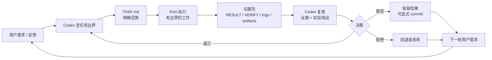

# KodeXimi

KodeXimi 是一个轻量的本地任务流：你仍然正常和 Codex 对话，由 Codex 负责拆任务和复核，Kimi CLI 在后台执行有边界的工作，并用文件留下证据。

> Alpha demo。不是生产级框架，不是安全沙箱。

## 这是什么

KodeXimi 的核心思路很简单：

- **你正常和 Codex 对话**，不需要直接管理每个中间文件。
- **Codex 负责定边界和复核**，把需要执行的工作包装成任务。
- **Kimi CLI 负责执行**，通过仓库内置的 custom agent 按任务边界工作。
- **文件负责留证据**，让 Codex 在下一轮用户决策前能复核发生了什么。

它不是某一类业务专用工具。代码实现、文档处理、脚本生成、测试修复、资料探索、产物生成、批量任务，都可以用同一套协议。

## 工作流示意



正常使用时，用户主要在一段工作开始前提出需求，在 Codex 复核后决定接受、返工、回退或继续。文件不是为了替代对话，而是为了让每段执行过程可见、可复核、可回退。

## 文件协议

一个普通任务目录类似这样：

```text
project/
  .kodeximi/
    enabled
  tasks/
    task-name/
      TASK.md              # 任务边界
      status.json          # 任务状态
      RESULT.md            # 执行结果说明
      VERIFY.md            # 验证记录，按任务需要生成
      CODEX_REVIEW.md      # 复核记录
      logs/
        kimi.stdout.log
        kimi.stderr.log
```

文件生命周期：

| 文件 | 产生阶段 | 使用阶段 | 作用 |
|---|---|---|---|
| `TASK.md` | 任务包装 | 执行 / 复核 | 定义目标、范围、允许读写、禁止路径、验证要求和 worker block |
| `PLAN.md` | 可选计划关口 | 执行前复核 | 记录预期读取、写入、测试、风险和问题 |
| `RESULT.md` | Worker 执行 | 复核关口 | 总结做了什么、读写了什么、产物、风险和待决策事项 |
| `VERIFY.md` | Worker 执行 | 复核关口 | 记录真实执行命令、工作目录、退出码、输出摘要和验证结论 |
| `logs/*` | Worker 执行 | 复核 / 调试 | 保存 stdout/stderr 和长输出 |
| `status.json` | 任务生命周期 | CLI / 复核关口 | 记录 `drafted`、`running`、`needs-review`、`failed` 等状态 |
| `CODEX_REVIEW.md` | 复核关口 | 下一轮迭代 / 留档 | 记录接受、拒绝或返工意见 |

## 快速开始

在仓库根目录执行：

```powershell
# 检查环境和项目结构
.\scripts\doctor.ps1
.\scripts\verify-install.ps1

# 初始化一个项目工作区。默认是 OFF。
.\cli\kodeximi.ps1 init-project .\my-project
.\cli\kodeximi.ps1 mode .\my-project

# 只在这个项目里启用 KodeXimi。
.\cli\kodeximi.ps1 enable .\my-project
.\cli\kodeximi.ps1 mode .\my-project

# 创建一个任务目录。
.\cli\kodeximi.ps1 new-task hello -Project .\my-project

# 编辑 .\my-project\tasks\hello\TASK.md，然后校验并执行。
.\cli\kodeximi.ps1 validate .\my-project\tasks\hello
.\cli\kodeximi.ps1 run .\my-project\tasks\hello

# 查看执行证据和复核状态。
.\cli\kodeximi.ps1 status .\my-project\tasks\hello
.\cli\kodeximi.ps1 result .\my-project\tasks\hello
.\cli\kodeximi.ps1 review-check .\my-project\tasks\hello -Project .\my-project
```

`install.ps1` 是可选的。Alpha 阶段建议优先使用仓库内命令，不急着全局安装。

## 命令说明

| 命令 | 作用 |
|---|---|
| `doctor` | 检查环境：`kimi`、`pwsh`、agent file、templates、UTF-8 输出 |
| `init-project <path>` | 创建 `tasks/`、`batches/` 和 `.kodeximi/` |
| `enable <projectPath>` | 创建 `.kodeximi/enabled`，启用 KodeXimi |
| `disable <projectPath>` | 删除 `.kodeximi/enabled`，关闭 KodeXimi |
| `mode <projectPath>` | 输出 `ON` 或 `OFF` |
| `new-task <name> [-Project <path>]` | 从模板创建任务目录 |
| `validate <taskDir>` | 检查任务目录结构和常见协议问题，不调用 Kimi |
| `run <taskDir> [-TimeoutSeconds <n>]` | 调用 Kimi CLI，使用 `--work-dir` 和 `--agent-file`，并捕获日志 |
| `status <taskDir>` | 打印 `status.json` |
| `result <taskDir>` | 打印 `RESULT.md` |
| `review-check <taskDir> [-Project <path>]` | 汇总证据、可能写错位置的 RESULT/VERIFY、Git 状态、diff、staged diff 和 untracked 文件 |
| `new-batch <name> [-Project <path>]` | 创建 batch 目录 |
| `run-batch <batchDir> [-MaxParallel <n>]` | 根据 manifest 执行一组任务，带基础写入冲突检查 |

## 目录结构

```text
KodeXimi/
  README.md
  ALPHA_NOTICE.md
  LICENSE
  .gitignore

  cli/
    kodeximi.ps1

  kimi/
    agents/
      codex-worker.yaml
      codex-worker-system.md

  codex/
    AGENTS_SNIPPET.md
    skills/
      kodeximi-router/
        SKILL.md

  templates/
    task/
      TASK.md
      RESULT.md
      VERIFY.md
      CODEX_REVIEW.md
      status.json
    batch/
      BATCH_TASK.md
      BATCH_MANIFEST.json
      BATCH_STATUS.json
      BATCH_REVIEW.md

  docs/
    architecture.md
    security-model.md
    alpha-limitations.md
    roadmap.md
    github-alpha-release-checklist.md

  scripts/
    doctor.ps1
    verify-install.ps1
    install.ps1
    uninstall.ps1

  examples/
    hello-worker/
    single-code-change/
    batch-independent-code/
    structured-input-discovery/
```

## 三层能力

### Core taskflow

核心能力是单任务闭环：

```text
TASK.md → Kimi --agent-file → RESULT.md / VERIFY.md / logs → Codex Review
```

这是当前最重要、最稳定的部分。

### Experimental batch

Batch 用来处理一组任务：

```text
BATCH_MANIFEST.json → 多个 task → 串行或有限并行 → 基础 allowed_writes 冲突检查
```

当前 batch 还是 alpha 功能，优先用于相互独立、写入范围清楚、没有复杂依赖的任务。不要把它当成熟调度器。

### Optional Codex integration

`codex/` 目录包含可选 Codex 集成：

```text
codex/AGENTS_SNIPPET.md
codex/skills/kodeximi-router/SKILL.md
```

它们的作用是帮助 Codex 更理解 KodeXimi：什么时候该写 TASK，什么时候该调用 Kimi，如何复核 RESULT / VERIFY / diff。它们不是 CLI 运行的必要条件，也不会自动安装。

## Git 复核模型

Kimi worker 默认不应该执行：

```text
git add
git commit
git push
git reset
git checkout
git switch
git clean
```

除非 `TASK.md` 明确允许具体命令。

Git 用于 Codex / 人工复核：

```powershell
git status --short
git diff --stat
git diff
git diff --cached --stat
git ls-files --others --exclude-standard
```

`review-check` 会汇总这些信号，但不会修改 Git 状态。

推荐真实项目使用方式：

```text
独立项目 Git root
→ clean baseline commit
→ Kimi 只改 TASK 允许的文件
→ Codex / 人读 RESULT、VERIFY、logs、产物、Git status、Git diff、untracked files
→ 显式接受、返工、回退或 commit
```

## 安全边界

这个项目不是安全沙箱。

- Kimi CLI 使用当前用户权限运行。
- `allowed_reads` 和 `allowed_writes` 是工作流指令，不是 OS 权限控制。
- wrapper 能捕获日志、检查证据文件，但不能阻止任意文件或网络访问。
- `VERIFY.md` 是 worker 提供的证据，不是最终证明。
- Codex / 人工复核、测试、CI 和 Git 纪律仍然重要。
- 当前 wrapper 使用 Kimi 自动化执行参数，不要把它当成生产仓库的安全执行环境。

更多说明：

- `ALPHA_NOTICE.md`
- `docs/architecture.md`
- `docs/security-model.md`
- `docs/alpha-limitations.md`
- `docs/roadmap.md`
- `docs/github-alpha-release-checklist.md`

## 当前不包含什么

Alpha 阶段故意不包含：

- 不自动 stage / commit。
- 不默认全局启用。
- 不提供 OS-level sandbox。
- 不引入 MCP / ACP / Wire / worktree / daemon / dashboard。
- 不提供成熟依赖调度器。
- 不替代 Codex / 人工 review。

## 适合什么场景

适合先尝试：

- 让 Codex 把具体执行任务交给 Kimi CLI；
- 长上下文、多文件、外部材料或结构化输入的受控整理；
- 代码实现、脚本生成、测试修复；
- 一组相似小任务的初级 batch；
- 需要 RESULT / VERIFY / logs 留证据的本地工作流；
- Windows + PowerShell 7 环境。

不适合直接用于：

- 生产敏感仓库；
- 没有 Git baseline 的混乱目录；
- 无人复核的全自动执行；
- 需要强安全隔离的任务；
- 复杂多 worker 调度和长期后台任务。

## License

MIT — see `LICENSE`.
